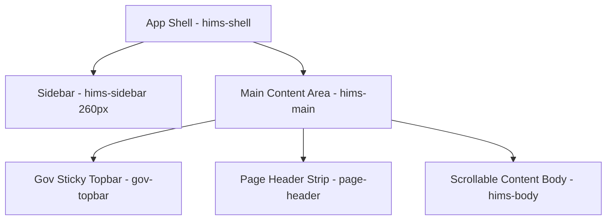

# Uttarakhand NHPR Portal — UI/UX Design System & Styling Standards

Version: 1.0 (Phase C Compliant)  
Reference Codebase: `patient_flow/css/hims.css` & `patient_flow/onboarding.html`

This document defines the official design tokens, layouts, components, and form standards to be followed when building all healthcare provider registries and registration flows.

---

## 1. Brand & Design Tokens

We follow the **Govt. of Uttarakhand State Health Platform** dark-first premium theme. All UI colors, surfaces, and spacing should refer to these custom properties:

```css
:root {
  /* ─── COLOR PALETTE ─── */
  /* Brand Neutrals (Navy Backgrounds) */
  --navy:            #071221;  /* Main page background */
  --navy-2:          #0a1628;  /* Card surface background */
  --navy-3:          #0e1e32;  /* Panels / Inner inputs background */
  
  /* Brand Accents */
  --saffron:       #e65100;  /* Primary branding (Govt. orange) */
  --saffron-mid:   #f57c00;  /* Hover / mid-states */
  --saffron-light: #ff8f00;  /* Highlights */
  --gold:          #f9a825;  /* Secondary branding accent */
  --gold-light:    #fdd835;
  
  /* Core Semantics */
  --primary:       #1565c0;  /* Primary actionable items (blue) */
  --primary-dark:  #003580;  
  --primary-light: #e3f2fd;  /* Light theme accents / badges */
  --accent:        #00695c;  /* Teal accent */
  --accent-light:  #e0f2f1;  
  --success:       #2e7d32;  /* Done / Approved status (green) */
  --success-light: #e8f5e9;
  --warning:       #f57c00;  /* Pending status (orange) */
  --warning-light: #fff3e0;
  --danger:        #c62828;  /* Rejected / Error / Alert (red) */
  --danger-light:  #ffebee;
  --purple:        #4527a0;  /* AI / Special fields */
  --purple-light:  #ede7f6;
  
  /* Text Colors */
  --text:          #e8f0fe;  /* High contrast body text */
  --text-sec:      #b0ccdc;  /* Secondary headers / lab labels */
  --text-muted:    #7b9bbf;  /* Hints / labels / placeholders */
  --text-light:    #5a7a8e;  /* Inactive states / timestamps */

  /* Borders */
  --border:        rgba(255, 255, 255, 0.08);  /* Primary thin border */
  --border-light:  rgba(255, 255, 255, 0.12);  /* High contrast borders */
  
  /* ─── BORDER RADIUS ─── */
  --r-xs:  4px;
  --r-sm:  6px;
  --r-md:  10px;
  --r-lg:  14px;
  --r-xl:  18px;
  --r-2xl: 24px;
  --r-full: 9999px;
  
  /* ─── TRANSITIONS ─── */
  --t-fast:  0.12s ease;
  --t-base:  0.18s ease;
  --t-slow:  0.28s ease;
}
```

---

## 2. Layout Structure (App Shell)

All registration screens must occupy a standard sidebar-integrated layout shell:



### Layout Elements:
1. **Sidebar Navigation (`.hims-sidebar`)**:
   - Fixed width of `260px` with a dark background (`--navy`).
   - Contains a logo box (`.sidebar-brand`) showing the state seal and branding text.
   - Contains a role/badge identifier (`.sidebar-role-badge`) displaying logged-in status.
   - Active nav item (`.nav-item.active`) is highlighted with `background: rgba(21,101,192,0.28)` and a left border indicator (`3px solid --sidebar-active-border`).
2. **Govt. Sticky Topbar (`.gov-topbar`)**:
   - Always visible, bordered at the bottom with a `3px solid var(--saffron)` strip.
   - Houses the official Uttarakhand emblem, Hindi text (`Noto Sans Devanagari` font), English text, and real-time status badges.
3. **Page Header (`.page-header`)**:
   - Contains page title (`.page-title`), subtitle (`.page-subtitle`), and right-aligned buttons.

---

## 3. UI Components

### 3.1 Stepper Wizard (`.stepper`)
Used in multi-step onboarding and registration wizards:
- **Active Step**: Uses blue gradient (`background: linear-gradient(135deg, #1565c0, #1976d2)`) with a glowing box-shadow.
- **Done/Completed Step**: Uses green (`background: #2e7d32`), displaying a checkmark.
- **Connectors**: Gray line (`height: 2px; background: rgba(255,255,255,.12)`) that lights up green as steps are completed.

```html
<div class="stepper">
  <div class="step done">
    <div class="step-circle"><i class="fas fa-check"></i></div>
    <div class="step-label">Authentication</div>
  </div>
  <div class="step-connector"></div>
  <div class="step active">
    <div class="step-circle">2</div>
    <div class="step-label">Professional Details</div>
  </div>
</div>
```

### 3.2 Cards (`.card`)
Cards act as the primary content containers:
- **Style**: Dark card body (`background: var(--navy-2); border: 1px solid var(--border)`).
- **Header (`.card-header`)**: Separated by a thin bottom border, holding a card title and context actions.
- **Accent Border**: A top accent border (`3px solid var(--primary)` or `var(--success)`) should be applied dynamically using `::before` or custom classes to define status categories.

### 3.3 Status Badges & Indicators
- **Pill Badges (`.badge`)**: Rounded with light background and colored labels (e.g. `.badge-green` has green label with `rgba(46,125,50,0.2)` bg).
- **Live Status Dots (`.status-dot`)**: Uses a circular pseudo-element with a pulse animation for critical warnings.
  ```css
  .status-dot.critical::before {
      background: var(--danger);
      animation: critPulse 1.2s infinite;
  }
  ```

---

## 4. Forms & Interactive Standards

Every input field must provide visual focus states and inline error feedback.

### 4.1 Grid Configurations
Use responsive CSS grid layouts for form layout sizing:
- **`.grid-2`**: two-column layout (`grid-template-columns: 1fr 1fr; gap: 16px;`)
- **`.grid-3`**: three-column layout
- **`.grid-4`**: four-column layout

### 4.2 Control States
- **Normal state**: Dark blue background, thin border.
- **Focus state**: Border lights up blue (`#1565c0`) with a glow ring (`box-shadow: 0 0 0 3px rgba(21,101,192,.15)`).
- **Required indicator**: Red star (`<span class="req">*</span>`) right-aligned to labels.
- **Error state**: Red border on input field (`.form-control.error`), displaying the hidden validation error block immediately.

```html
<div class="form-group">
  <label for="reg-no">Registration Number <span class="req">*</span></label>
  <input type="text" id="reg-no" class="form-control error" placeholder="UK-12345">
  <div class="form-error">Please enter a valid medical registration number.</div>
</div>
```

### 4.3 Upload Cards (`.doc-upload-item`)
Used for doctor/nurse certificate and identity uploads:
- **Style**: Dashed border (`1.5px dashed rgba(255,255,255,.12)`), changing to solid green when a document is uploaded.
- Includes file size limits and file format hints.

---

## 5. UI Animations & Feedback (Micro-interactions)
- **Buttons**: Focus shadows on keyboard navigation, minor scale-down click transition (`active:scale-[0.98]`).
- **Toast Notifications**: Slide in from right with a progress bar indicator.
- **Floating Logo**: Hover effects with float translation.
- **Loaders**: Clean spin loops for async submissions.
